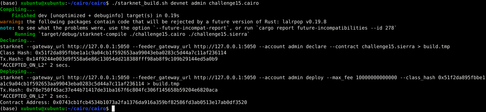
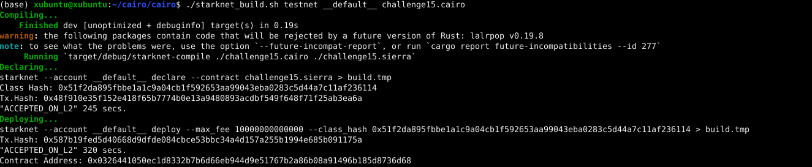

# Starknet_build
A bash shell to compile, declare and deploy Starknet Smart Contracts in just one call.
(only tested in ubuntu).

Any comments/corrections please reach me at my twitter account: [@devnet0x](https://twitter.com/devnet0x/)

## Usage ##


```
./starknet_build.sh <environment> <account> <cairo_file> [constructor parameters]
```
Where:

environment            : devnet or testnet or testnet2

key                    : Account name configurated in starknet_open_zeppelin_accounts.json

cairo_file             : Cairo source code file

constructor parameters : Constructor parameters (felt formatted)

## Example ##

In devnet:



In testnet:


